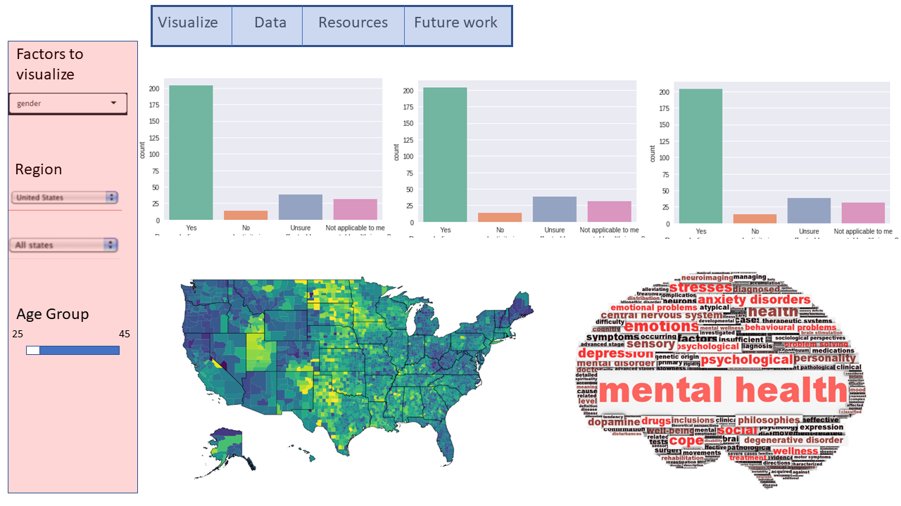
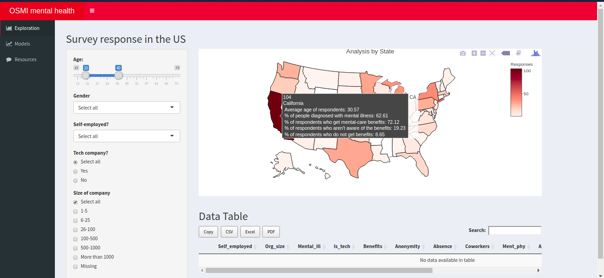
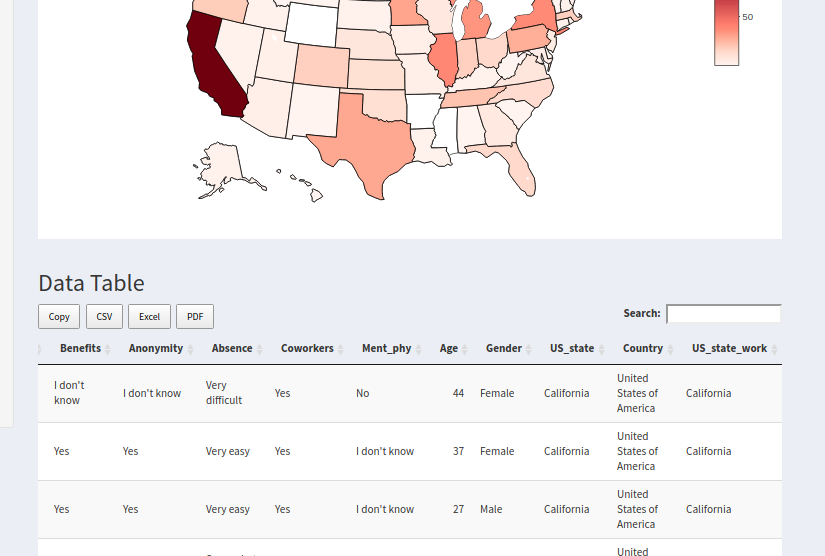
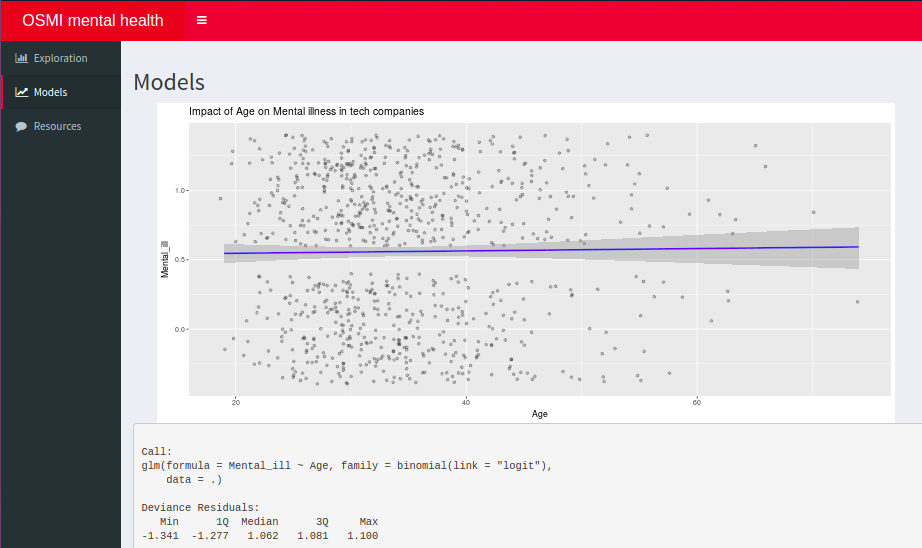
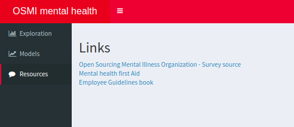

# Milestone 2

## Topic: Mental health project

My initial mockup of for the project focused on helping Rachel decide an ideal destination to apply for a web development role. For this project, I will only be focusing on states in the US although there is data for other countries such as UK and Canada. The one thing that was lacking in the mockup was the absence of filters to slice the information.

### How have your visualization goals changed?

The goal of my visualization has slightly expanded in terms of looking at the impact of age on mental illness as well. This is mainly to understand if Rachel should be looking at the average age of the company before deciding to apply as well.

My current mockup helps Rachel filter data by "Age", "Gender" and "Size of the company" mainly. The prime focus of the application is the map which highlights information about the number of respondents from the state, the average age of respondents, the percentage of respondents receiving health care benefits for mental illness and finally percentage of people who have been diagnosed for mental illness.

In the interest of time, I have replaced the word cloud with a table that gets populated based on state selection. I decided to replace the information provided by the bars with tooltips on the map.

I have added another tab called "Models" which shows the relationship between age and Mental illness among the respondents working in the US. I haven't considered other countries here as the working culture might vary across countries which is not easy to quantify.

### Application walkthrough

I was able to obtain the dataset from [Kaggle](https://www.kaggle.com/osmi/mental-health-in-tech-2016). This dataset had 63 columns corresponding to 63 survey questions! For the purpose of this analysis, I have excluded questions pertaining to *previous employers*. The survey had a blank text box for gender(kudos!) which resulted in close to 60 different entries. The one thing I noticed was the other forms of gender weren't represented very well in this survey which is why I have classified them into a single group resulting in 3 levels of gender.

On the visual side of things, I've chosen a red palette for this application for 2 reasons -
1. The company that conducted the survey use a red palette for their website
2. I would like this application to catch people's attention about a topic that is still considered taboo

I have organized the application into 3 tabs -
1. Exploration
2. Models
3. Resources

##### 1. Exploration Tab

The map is the centrepiece of this tab. It allows user(Rachel in this case) slice the data by various parameters and views the results of the survey by state. I've chosen to display pivotal information on the tooltips of the map(% of companies offering benefits, %of mental illness..). This should give the user a good idea about the situation across various states.

The user also has the ability to view data for a state in the form of a table by clicking on the "state of interest".

The user can choose to export this data into one of the following file formats as well - `CSV, Excel or PDF`

##### 2. Models Tab

This tab explores the relationship between age of respondents in the US and their mental health. For this model I've used the answer to the question -  **Have you ever been diagnosed with a Mental illness by a professional?**

The results show that age does not play a significant role in determining the mental health of the survey respondent.

##### 3. Resources tab

This tab has useful links for anyone who is interested in learning more about mental health in the tech industry as well as helpline links.

### Does your app enable the tasks you set out to facilitate?

The initial draft of my application does provide Rachel with the necessary tools to get started on the job hunt process. Future releases of this application should give her all more information regarding the working conditions in tech companies.
