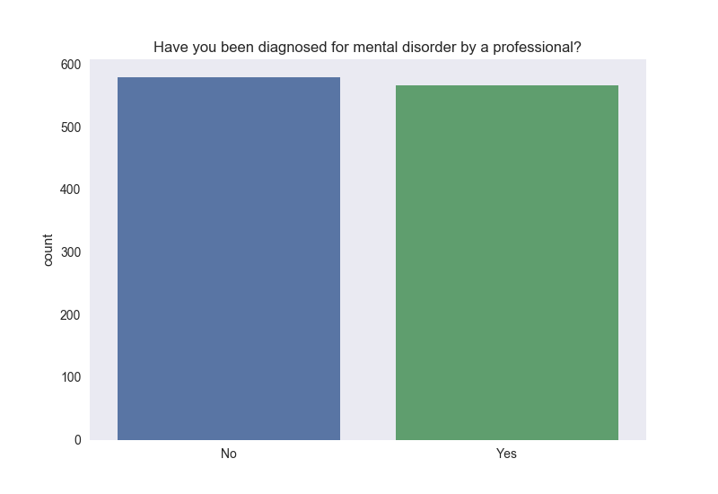
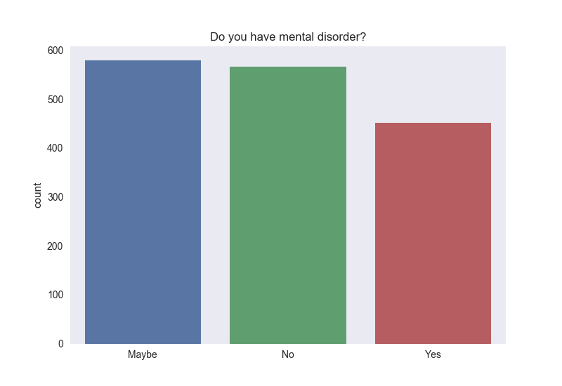
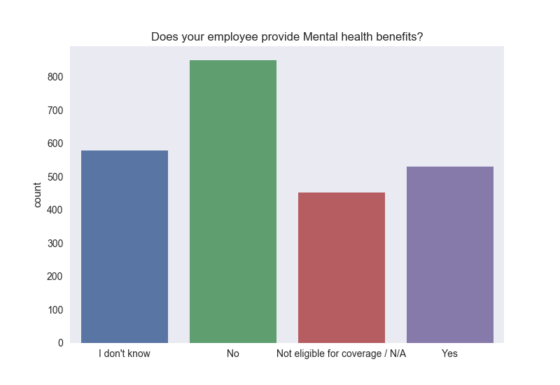
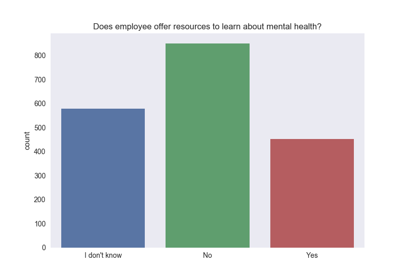

The past few weeks have brought issues related to mental health to my notice. I found myself feeling homesick, reading about the student who jumped to his death and more stress related outbursts at work places. After reading about all this I wanted to be able to put my skills to use in studying the mental health landscape across various parts of the world to draw meaninful inferences.

For this project I will be analyzing the data on mental health from a survey conducted by [Open Source Mental lllness for tech companies(OSMI)](https://osmihelp.org/).

## Dataset

OSMI is a non-profit corporation that help raise awareness and provide mental resources to support mental wellness in the tech as well as open source community.

The Mental Health in Tech Survey they conducted in 2014 garnered close to 1200 responses, and is believed to be the largest survey conducted on mental health in the tech industry. They followed this up with a survey in 2016 which garnered close to 1400 responses.

Since this is an open survey one can expect some sort of bias in the dataset. You would most likely have people interested in this field participating in the survey.

I was able to obtain their 2016 dataset from the [data world forum](https://data.world/kittybot/osmi-mental-health-tech-2016)

The dataset consists of responses from 1433 usrs with each of them filling out 63 questions. There are lot of text field with NULL values, but most variables I will be considering have few or 0 NULL values.

There are several questions that pertain to the employee's view on mental health at their workplace. At the end the hypothesis I am trying to test is whether tech companies provide enough resources/help for people to overcome the various forms of stress.

## Findings 

For this analysis I have removed self-employed participants to whom most of the questions pertaining to employer or colleagues do not apply. 

**1. How big a problem is it?**

To look at how many people suffered from some sort of mental health issue I look at 2 questions
- Have you been diagnosed with a mental health condition by a medical professional? (Figure 1)
- Do you currently have a mental health disorder (Figure 2)

My intution her was that the first question might provide a more reliable answer compared to the 2nd one as it leaves less scope for interpretation.

It is alarming to notice that almost 50% of the respondeants seems to have been diagnosed for mental disorder, this can again be tied back to selection bias that occurs in surveys of such nature.

**2. Does gender play a role?**

The survey initially had up to 71 different response for gender as this was an text field. For sake of analysis  I decided to factor this into 3 types - Male, Female and Non-binary. The responses were far and few for the non-binary type which resulted in having to classify them into a single group for analysis.

We notice that the survey is male dominated. This might be attributed to the gender imbalance that is prelevant in the tech industry, that has come into sharp focus off late. 

We now try to find questions pertaining to workplaces to analyze the response:

**3. Does your employee offer mental health benefits as part of the healthcare package?**

Apart from those not eligible for coverage, it is alarming to notice the number of responses for employees that do not offer mental health benefits. This is an immediate concern as this might deter people from seeking professional help in the fear of shelling out large sum of money.

**4. Does your employer offer resources to learn more about mental health concerns and options for seeking help?**

This graph shows a lot of employees that do not provide adequate resources regarding mental health. This is concerning especially if they haven't failed to recognize this as a problem in the first place.

**5. Do you feel that your employer takes mental health as seriously as physical health?**

We have most employers nowadays providing extensive health coverage for physical ailments/injuries. The same trend is not observed in the case of mental health. More than half the survey respondents feel that their company does not pay equal importance to mental health.

**6. Do you think that discussing a mental health disorder with your employer would have negative consequences?**

Though there is no mention of what the negative consequences are the survey seems to indicate a significant portion seems to think discussing mental health/disorders could have a potential negative impact. This could deter a these people from approaching the supervisors and could easily cascade to a serious condition.

The last question I analyze is what we as co-workers are doing to ensure people feel safe and are happy working around us. The question I consider for this analysis is:

**7. Would you feel comfortable discussing a mental health disorder with your coworkers?**

The results of this graph was truly shocking. It seems to suggest an alarmingly high percent of the respondents would not be comfortable in discussing their medical health condition with their co-workers. In a big tech company usually co-workers act as support mechanisms during times of extreme stress. Everyone does not react to stress in the same way. For those who get stressed out more than others it is beneficial to talk to other co-workers about this and try to find a resolution. The fact that people are not comfortable talking to co-workers, or work in a company that does not offer mental health benefits could result in dire consequences. 

## Final thoughts

Given the taboo around mental health in general, I feel the tech companies can do a much better job at providing their employees the right set of tools to be able to lead a mentally healthy life. On the flip side since this is an open survey and accounting for selection bias the actual numbers might be much lower.

## Future work

Building a model that checks for interaction effect among the factors is definitely a possibility. It might be beneficial to consider other factors as well during the analysis. 

