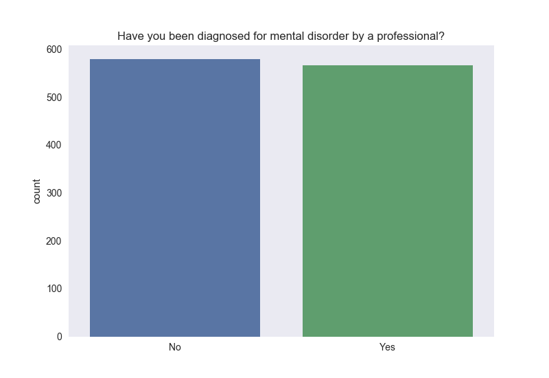
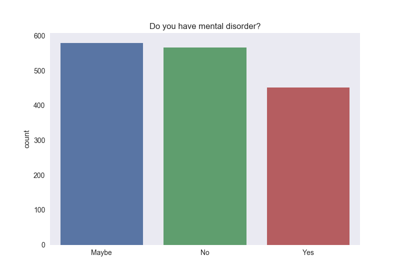
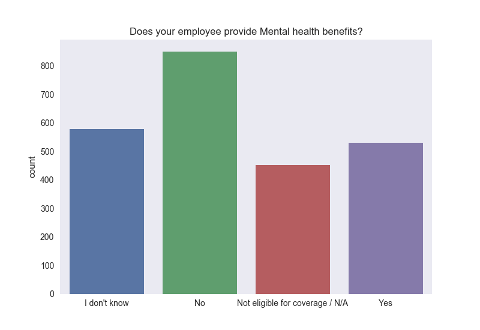
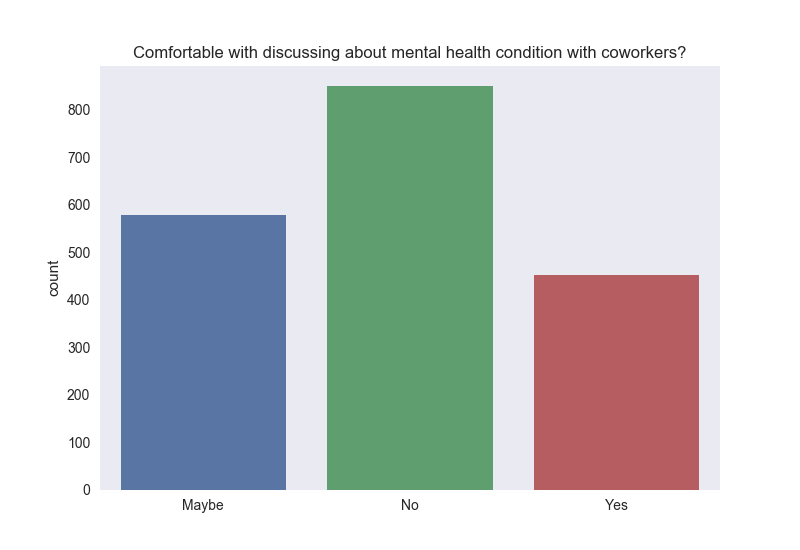

Final report - OSMI 2016 Mental Health survey
================
Abishek Murali
10 December 2017

The past few weeks have brought issues related to mental health to my
notice. I found myself feeling homesick, reading about the student who
jumped to his death and more stress related outbursts at work places.
After reading about all this I wanted to be able to put my skills to use
in studying the mental health landscape across various parts of the
world to draw meaninful inferences.

For this project I will be analyzing the data on mental health from a
survey conducted by [Open Source Mental lllness for tech
companies(OSMI)](https://osmihelp.org/).

## Dataset

OSMI is a non-profit corporation that help raise awareness and provide
mental resources to support mental wellness in the tech as well as open
source community.

The Mental Health in Tech Survey they conducted in 2014 garnered close
to 1200 responses, and is believed to be the largest survey conducted on
mental health in the tech industry. They followed this up with a survey
in 2016 which garnered close to 1400 responses.

Since this is an open survey one can expect some sort of bias in the
dataset. You would most likely have people interested in this field
participating in the survey.

I was able to obtain their 2016 dataset from the [data world
forum](https://data.world/kittybot/osmi-mental-health-tech-2016)

The dataset consists of responses from 1433 usrs with each of them
filling out 63 questions. There are lot of text field with NULL values,
but most variables I will be considering have few or 0 NULL values.

There are several questions that pertain to the employee’s view on
mental health at their workplace. At the end the hypothesis I am trying
to test is whether tech companies provide enough resources/help for
people to overcome the various forms of stress.

## Findings

For this analysis I have removed self-employed participants to whom most
of the questions pertaining to employer or colleagues do not apply.

1.  How big a problem is it?

To look at how many people suffered from some sort of mental health
issue I look at 2 questions - Have you been diagnosed with a mental
health condition by a medical professional? (Figure 1) - Do you
currently have a mental health disorder (Figure 2)

My intution her was that the first question might provide a more
reliable answer compared to the 2nd one as it leaves less scope for
interpretation.

It is alarming to notice that almost 50% of the respondeants seems to
have been diagnosed for mental disorder, this can again be tied back to
selection bias that occurs in surveys of such nature.

2.  Does gender play a role?

The survey initially had up to 71 different response for gender as this
was an text field. For sake of analysis I decided to factor this into 3
types - Male, Female and Non-binary. The responses were far and few for
the non-binary type which resulted in having to classify them into a
single group for analysis.

We notice that the survey is male dominated. This might be attributed to
the gender imbalance that is prelevant in the tech industry, that has
come into sharp focus off late.

We now try to find questions pertaining to workplaces to analyze the
response:

3.  Does your employee offer mental health benefits as part of the
    healthcare package?

Apart from those not eligible for coverage, it is alarming to notice the
number of responses for employees that do not offer mental health
benefits. This is an immediate concern as this might deter people from
seeking professional help in the fear of shelling out large sum of
money.

4.  Does your employer offer resources to learn more about mental health
    concerns and options for seeking help?

This graph shows a lot of employees that do not provide adequate
resources regarding mental health. This is concerning especially if they
haven’t failed to recognize this as a problem in the first place.

5.  Do you feel that your employer takes mental health as seriously as
    physical health?

We have most employers nowadays providing extensive health coverage for
physical ailments/injuries. The same trend is not observed in the case
of mental health. More than half the survey respondents feel that their
company does not pay equal importance to mental health.

6.  Do you think that discussing a mental health disorder with your
    employer would have negative consequences?

Though there is no mention of what the negative consequences are the
survey seems to indicate a significant portion seems to think discussing
mental health/disorders could have a potential negative impact. This
could deter a these people from approaching the supervisors and could
easily cascade to a serious condition.

The last question I analyze is what we as co-workers are doing to ensure
people feel safe and are happy working around us. The question I
consider for this analysis is:

7.  Would you feel comfortable discussing a mental health disorder with
    your coworkers?

The results of this graph was truly shocking. It seems to suggest an
alarmingly high percent of the respondents would not be comfortable in
discussing their medical health condition with their co-workers. In a
big tech company usually co-workers act as support mechanisms during
times of extreme stress. Everyone does not react to stress in the same
way. For those who get stressed out more than others it is beneficial to
talk to other co-workers about this and try to find a resolution. The
fact that people are not comfortable talking to co-workers, or work in a
company that does not offer mental health benefits could result in dire
consequences.

## Final thoughts

Given the taboo around mental health in general, I feel the tech
companies can do a much better job at providing their employees the
right set of tools to be able to lead a mentally healthy life. On the
flip side since this is an open survey and accounting for selection bias
the actual numbers might be much lower.

## Future work

Building a model that checks for interaction effect among the factors is
definitely a possibility. It might be beneficial to consider other
factors as well during the analysis.
